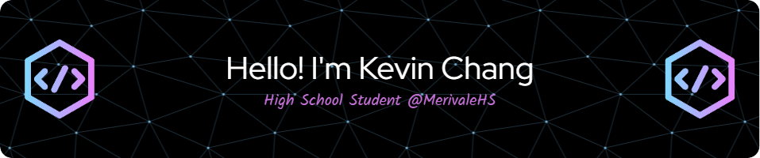

</img>

### :grin: &nbsp;About Me

- Grade 11 High school student at Merivale High School (IB Programme)
- Find me in Ottawa, Ontario, Canada
- Love coding and attending hackathons
- Competitive Badminton Player!
- Currently grinding Hack Club events

  &nbsp;&nbsp;&nbsp;&nbsp;
  &nbsp;&nbsp;&nbsp;&nbsp;
  &nbsp;&nbsp;&nbsp;&nbsp;

  
<b>:computer: &nbsp;My best technologies</b>

   
  
&nbsp;
&nbsp;\
&nbsp;
&nbsp;
&nbsp;\
&nbsp;
&nbsp;\

\
&nbsp;

  
<b>:brain: &nbsp;Learning/Want to learn</b>

   

&nbsp;\
&nbsp;\
&nbsp;\
&nbsp;\
&nbsp;\
&nbsp;

<b>:gear: &nbsp;Statistics</b>

